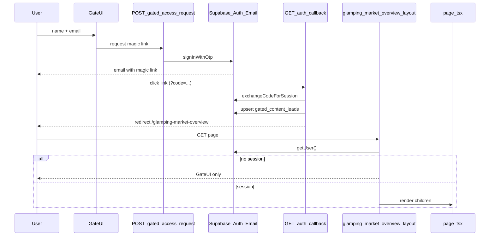

# Supabase magic link gate for Glamping Market Overview

## Goal

Require visitors to submit **name + email**, receive a **Supabase magic link**, and only then render the full `[app/glamping-market-overview/page.tsx](app/glamping-market-overview/page.tsx)` (which currently loads all metrics server-side with `force-dynamic`).

**Access policy (confirmed):** any valid email address (B2B lead capture).

**Out of scope:** changing admin auth (Google OAuth + `[managed_users](lib/auth-helpers.ts)` + `[requireAdminAuth](lib/require-admin-auth.ts)`). Public magic-link users will not pass admin checks; `[AdminAuthGuard](components/AdminAuthGuard.tsx)` already signs out non-`@sageoutdooradvisory.com` users.

---

## Architecture




**Why a layout, not a client overlay:** the page is a Server Component that fetches metrics before JSX. A client-only modal would still leak data in HTML. A server `[layout.tsx](app/glamping-market-overview/layout.tsx)` must choose gate vs `children` before `page.tsx` runs.

---

## 1. Supabase Dashboard configuration

Before code ships, configure the existing project (document steps in a short `docs/` note or extend `[docs/admin/SUPABASE_GOOGLE_OAUTH_SETUP.md](docs/admin/SUPABASE_GOOGLE_OAUTH_SETUP.md)`):


| Setting                                | Value                                                              |
| -------------------------------------- | ------------------------------------------------------------------ |
| **Authentication → Providers → Email** | Enabled                                                            |
| **Confirm email**                      | On (magic link verifies ownership)                                 |
| **Site URL**                           | Production origin                                                  |
| **Redirect URLs**                      | `http://localhost:3003/auth/callback`, production `/auth/callback` |


Reuse the existing PKCE callback at `[app/auth/callback/route.ts](app/auth/callback/route.ts)` (already exchanges `code` via `[createServerClientWithCookies](lib/supabase-server.ts)`).

Customize the magic-link email template (subject/body) in Supabase → Authentication → Email Templates.

---

## 2. Database: leads table + RLS

Add migration under `[scripts/migrations/](scripts/migrations/)` (e.g. `create-gated-content-leads-2026-05-18.sql`):

```sql
create table public.gated_content_leads (
  id uuid primary key default gen_random_uuid(),
  user_id uuid references auth.users (id) on delete set null,
  email text not null,
  name text,
  page_slug text not null,
  created_at timestamptz not null default now(),
  verified_at timestamptz,
  unique (email, page_slug)
);

create index gated_content_leads_page_slug_idx on public.gated_content_leads (page_slug);
alter table public.gated_content_leads enable row level security;

-- Authenticated user can upsert their own row after magic-link sign-in
create policy gated_leads_upsert_own on public.gated_content_leads
  for insert to authenticated with check (auth.uid() = user_id);

create policy gated_leads_update_own on public.gated_content_leads
  for update to authenticated using (auth.uid() = user_id);

-- Service role / admin reads later (optional policy for managed_users role)
```

**Callback upsert** (after successful `exchangeCodeForSession`):

- `user_id`, `email`, `name` from `user.user_metadata.full_name`
- `page_slug` from `redirect` param or default `glamping-market-overview`
- set `verified_at = now()`

No separate passcode table—Supabase owns OTP/link lifecycle.

---

## 3. Shared library

New `[lib/gated-access.ts](lib/gated-access.ts)`:


| Export                                        | Purpose                                                                        |
| --------------------------------------------- | ------------------------------------------------------------------------------ |
| `GATED_PAGE_GLAMPING_MARKET_OVERVIEW`         | slug constant                                                                  |
| `getGatedPageRedirectPath(slug)`              | maps slug → `/glamping-market-overview` (extensible later)                     |
| `buildMagicLinkRedirectUrl(origin, pageSlug)` | `${origin}/auth/callback?redirect=...`                                         |
| `hasGatedPageSession(user)`                   | `user` exists and `email_confirmed_at` set (or `user.email` present post-link) |


Keep admin helpers in `[lib/auth-helpers.ts](lib/auth-helpers.ts)` unchanged.

---

## 4. API: request magic link (rate-limited)

`**POST /api/gated-access/request`** — new route under `[app/api/gated-access/request/route.ts](app/api/gated-access/request/route.ts)`:

**Body:** `{ name: string, email: string, pageSlug?: string }` (default slug = glamping overview).

**Validation:** trim, basic email regex, name min length (e.g. 2 chars).

**Rate limits** (reuse `[lib/upstash.ts](lib/upstash.ts)`):

- 3 requests / email / hour
- 10 requests / IP / hour  
Degrade gracefully when Upstash env is missing (same pattern as existing helpers).

**Auth call** (server Supabase anon client with cookies not required for send):

```ts
await supabase.auth.signInWithOtp({
  email,
  options: {
    shouldCreateUser: true,
    data: { full_name: name, gated_page: pageSlug },
    emailRedirectTo: buildMagicLinkRedirectUrl(origin, pageSlug),
  },
});
```

**Response:** always generic success (`{ ok: true }`) to avoid email enumeration; log errors server-side.

**Optional:** wire `botid` on this route if you add it elsewhere later (package already in `[package.json](package.json)`).

---

## 5. Extend auth callback

Update `[app/auth/callback/route.ts](app/auth/callback/route.ts)` after successful `exchangeCodeForSession`:

1. `getUser()` from the same cookie-backed client.
2. Parse `redirect` query param; if it matches a gated page path, upsert into `gated_content_leads`.
3. Redirect via existing `getSafeRedirect()` (already restricts open redirects).

Default redirect for gated flow: `/glamping-market-overview` (not `/admin/dashboard`).

**Note:** Today callback defaults to `/admin/dashboard` when `redirect` is absent—gate form must always pass `redirect=/glamping-market-overview`.

---

## 6. UI + layout (server gate)


| File                                                                                                                     | Role                                                                  |
| ------------------------------------------------------------------------------------------------------------------------ | --------------------------------------------------------------------- |
| `[app/glamping-market-overview/layout.tsx](app/glamping-market-overview/layout.tsx)`                                     | `getUser()`; if no session → render gate only; else `{children}`      |
| `[components/glamping-industry/GlampingMarketAccessGate.tsx](components/glamping-industry/GlampingMarketAccessGate.tsx)` | Client form: name, email, submit → API; then “Check your email” state |


**Gate UX:**

1. Form step (name, email, privacy note + link to `[app/privacy-policy/page.tsx](app/privacy-policy/page.tsx)`).
2. Success step: instruct user to click the link (no passcode field).
3. Match existing page visual language (topo background / neutral palette from `[page.tsx](app/glamping-market-overview/page.tsx)`).

**i18n:** route is already excluded from locale middleware (`[middleware.ts](middleware.ts)` line 183). Use English copy inline for now (consistent with this page’s metadata).

---

## 7. SEO and metadata

In `[app/glamping-market-overview/page.tsx](app/glamping-market-overview/page.tsx)` metadata, consider `robots: { index: false, follow: false }` while gated so crawlers do not index a login wall. Optional public teaser can be added later.

---

## 8. Privacy

Add one bullet to `[app/privacy-policy/page.tsx](app/privacy-policy/page.tsx)`: name/email collected for gated market reports; magic-link auth via Supabase; retention purpose (lead follow-up).

---

## 9. Security notes (built into implementation)


| Risk                                   | Mitigation                                                                                                                |
| -------------------------------------- | ------------------------------------------------------------------------------------------------------------------------- |
| Metrics leaked in HTML                 | Server layout blocks `page.tsx` when unauthenticated                                                                      |
| Public user hits `/admin` with session | Middleware only checks session; `[AdminAuthGuard](components/AdminAuthGuard.tsx)` + APIs enforce domain + `managed_users` |
| Email enumeration                      | Generic API responses                                                                                                     |
| Abuse / spam signups                   | Upstash rate limits + Supabase Auth rate limits                                                                           |
| Open redirect                          | Reuse `getSafeRedirect()` in callback                                                                                     |


**Optional follow-up (not required for v1):** tighten `[middleware.ts](middleware.ts)` `/admin` branch to call `isManagedUser` server-side and skip client flash for non-admin sessions.

---

## 10. Tests


| Test file                                    | Coverage                                                  |
| -------------------------------------------- | --------------------------------------------------------- |
| `__tests__/lib/gated-access.test.ts`         | redirect URL builder, `hasGatedPageSession`, slug mapping |
| `__tests__/api/gated-access/request.test.ts` | validation + rate-limit behavior (mock Upstash)           |


Manual test checklist:

1. Submit form → receive Supabase email (check spam).
2. Click link → land on overview with full metrics.
3. Refresh → still unlocked (session cookie).
4. Sign out (optional small “Sign out” in gate footer) → gate returns.
5. `random@gmail.com` → cannot use `/admin` APIs or stay in admin UI.

---

## File summary


| Action | Path                                                                |
| ------ | ------------------------------------------------------------------- |
| Create | `scripts/migrations/create-gated-content-leads-*.sql`               |
| Create | `lib/gated-access.ts`                                               |
| Create | `app/api/gated-access/request/route.ts`                             |
| Create | `app/glamping-market-overview/layout.tsx`                           |
| Create | `components/glamping-industry/GlampingMarketAccessGate.tsx`         |
| Edit   | `app/auth/callback/route.ts`                                        |
| Edit   | `app/privacy-policy/page.tsx` (minor)                               |
| Edit   | `app/glamping-market-overview/page.tsx` (robots metadata, optional) |
| Create | tests under `__tests__/`                                            |
| Docs   | Supabase Email + redirect URL checklist                             |


**Estimated effort:** 1–2 days including Supabase template tuning and end-to-end email testing in production.