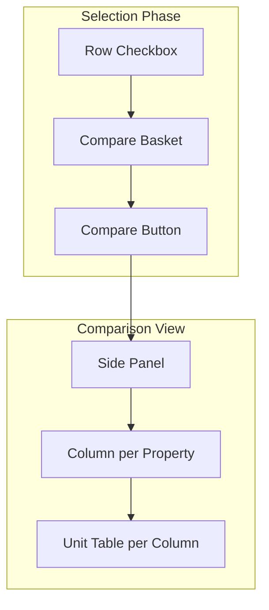
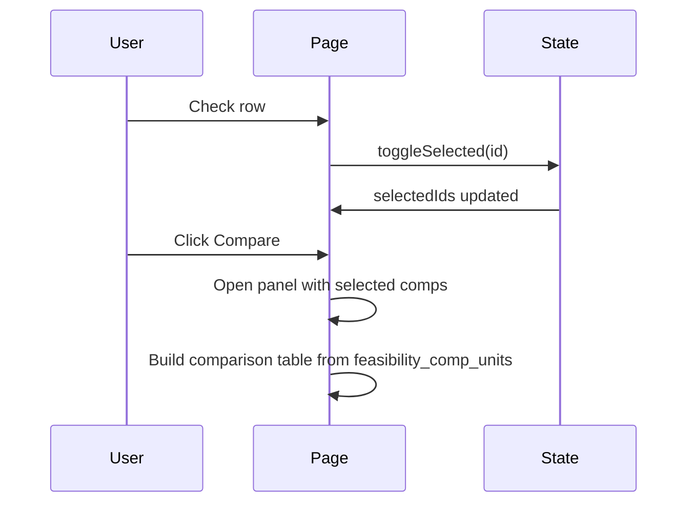

# Compare Mode for Comparables

## Overview

Add a "Compare mode" to the `/admin/comparables` page that lets users select 2–4 comparables and view their unit breakdowns side by side. Useful for comparing similar properties.

## Current State

- **Page:** [app/admin/comparables/page.tsx](app/admin/comparables/page.tsx)
- **Features:** Expandable rows, unit details per row, report links, CSV/Excel export, deep link (`?expand=compId`)
- **Data:** Each comparable has `feasibility_comp_units` (unit_type, unit_category, num_units, low_adr, peak_adr, low_occupancy, peak_occupancy, quality_score)
- **Challenge:** Unit types vary by property (e.g., "Treehouse" vs "Dome" vs "Cabin") — no 1:1 alignment across properties

## Architecture



## Design Decisions

### 1. Selection UI

| Option | Pros | Cons |
|--------|------|------|
| **A: Row checkboxes** | Clear affordance, familiar pattern | Extra column |
| **B: "Add to compare" button** | Less clutter | Less discoverable |

**Recommendation:** Option A (checkboxes) — standard pattern for multi-select tables.

### 2. Compare View Location

| Option | Pros | Cons |
|--------|------|------|
| **A: Side panel** | Keeps list visible, no navigation | Limited width on small screens |
| **B: Modal** | Focused view | Full context switch |
| **C: Dedicated route** | Shareable URL, bookmarkable | Extra navigation |

**Recommendation:** Option A (side panel) for v1. Add Option C (deep link `?compare=id1,id2`) in a later phase.

### 3. Side-by-Side Layout

**Structure:** One column per selected comparable (max 4).

| Metric | Live Oak Lake | Onera | Domance |
|--------|---------------|-------|---------|
| **Summary** | | | |
| Sites | 19 | 28 | 4 |
| Quality | 4.5 | 4.5 | 4.0 |
| ADR Range | $496–$896 | $150–$225 | $123–$422 |
| Occupancy | 75%–96% | 75%–95% | 60%–95% |
| **Unit Types** | | | |
| treehouse | 5 sites, $795–$896 | 6 sites, $195 | — |
| dome | 8 sites, $565–$736 | — | 5 sites, $130–$422 |
| cabin | — | 5 sites, $150 | — |
| tent | — | 6 sites, $215–$225 | — |

**Unit alignment:** Use `unit_category` (treehouse, dome, cabin, tent, etc.) as the row key. Each property column shows its unit for that category, or "—" if none. Categories are the union of all selected properties' unit categories, sorted.

### 4. Selection Limits

- **Min:** 2 comparables to enable Compare
- **Max:** 4 comparables
- **Persistence:** Clear selection when page, search, or sort changes (same as `expandedIds`)

---

## Implementation Plan

### Phase 1: Selection State and UI

1. **State**
   - Add `selectedIds: Set<string>`
   - Add `toggleSelected(id: string)` and `clearSelected()`
   - Clear `selectedIds` when `page`, `debouncedSearch`, `sortBy`, or `sortDir` change

2. **Checkbox column**
   - New header column (left of Property) with optional "Select all on page"
   - Checkbox per row; use `stopPropagation` so clicking doesn't expand
   - When `selectedIds.size >= 4`, disable checkboxes for unselected rows

3. **Compare bar**
   - Sticky bar at bottom when `selectedIds.size >= 2`:
     - Text: "Compare X properties"
     - [Clear] button
     - [Compare] button (opens panel)

### Phase 2: Compare Side Panel

1. **Panel component**
   - Slide-in from right (`w-full max-w-2xl` or similar)
   - Fixed position, semi-transparent backdrop
   - Header: "Compare", [X] close, optional "Export comparison"

2. **Layout**
   - **Summary section:** One row per metric (Sites, Quality, ADR Range, Occupancy); one column per property
   - **Unit section:** Rows by `unit_category`; columns by property; each cell shows unit type, sites, ADR range, occupancy, quality (or "—")

3. **Data logic**
   - Filter `comparables` by `selectedIds`
   - Collect all `unit_category` values across selected comps, dedupe, sort
   - For each category row, look up each comp's unit with that category; render or "—"

### Phase 3: Polish

1. **Deep link**
   - Support `?compare=id1,id2` (or `id1,id2,id3`) to pre-select and open compare
   - Parse on load, set `selectedIds`, open panel

2. **Export**
   - "Export comparison" in panel: CSV/Excel of the comparison table

3. **Responsive**
   - On mobile: stack columns vertically or horizontal scroll

---

## Files to Modify

| File | Changes |
|------|---------|
| [app/admin/comparables/page.tsx](app/admin/comparables/page.tsx) | `selectedIds` state, checkbox column, compare bar, compare panel |

## Optional: New Component

- `ComparablesComparePanel.tsx` — extract panel if logic grows (e.g., 100+ lines)

---

## Data Flow



---

## Edge Cases

| Case | Handling |
|------|----------|
| Selected comp on another page | Clear selection on page change |
| Comp with no units | Show "—" in unit rows |
| Different unit categories | Show all categories; empty cells per property |
| 1 selected | Disable Compare button; show "Select at least 2" |
| 5+ selected | Disable checkboxes for unselected rows at 4 |

---

## UI Sketch

```
[Table]
| ☐ | Property          | Job #    | State | ... | Reports |
| ☐ | Live Oak Lake     | 25-101A  | TX    | ... | [icon]  |
| ☑ | Onera             | 25-101A  | TX    | ... | [icon]  |
| ☑ | Domance           | 25-101A  | TX    | ... | [icon]  |

[Sticky bar when 2+ selected]
┌─────────────────────────────────────────────────────────────┐
│ Compare 2 properties              [Clear]  [Compare]       │
└─────────────────────────────────────────────────────────────┘

[Side panel when Compare clicked]
┌─────────────────────────────────────────────────────────────┐
│ Compare                                          [X]        │
├─────────────────────────────────────────────────────────────┤
│                 │ Onera           │ Domance                 │
│ Sites           │ 28              │ 4                       │
│ Quality         │ 4.5             │ 4.0                     │
│ ADR Range       │ $150 – $225     │ $123 – $422             │
│ Occupancy       │ 75% – 95%       │ 60% – 95%               │
├─────────────────┼─────────────────┼─────────────────────────┤
│ treehouse       │ 6 sites         │ —                       │
│                 │ $195            │                         │
│ dome            │ —               │ 5 sites                 │
│                 │                 │ $130 – $422             │
│ cabin           │ 5 sites         │ —                       │
│                 │ $150            │                         │
└─────────────────────────────────────────────────────────────┘
```

---

## Effort Estimate

| Phase | Effort |
|-------|--------|
| Phase 1: Selection | 2–3 hours |
| Phase 2: Panel | 3–4 hours |
| Phase 3: Polish | 1–2 hours |
| **Total** | **6–9 hours** |
