# Research Pipeline Architecture: Tavily, Firecrawl, OpenAI

This document describes the high-accuracy research pipeline used for entity data collection (ski resorts, glamping properties, etc.). The pipeline combines **Tavily** (web search), **Firecrawl** (deep page scraping), and the **OpenAI API** (structured extraction and discovery). The architecture is **domain-agnostic** and can be adapted for hotels, restaurants, campgrounds, venues, or companies.

---

## 1. The Three Services

| Service | Role | When to use |
|--------|------|-------------|
| **Tavily** | Web search with raw markdown content | Discovery, stable facts, volatile data (prices, reviews), market context |
| **Firecrawl** | Deep scrape of specific URLs (JS-rendered pages) | Unit amenities, booking URLs, pricing from property/listing pages |
| **OpenAI API** | List entities (discovery), extract structured data from content (GPT + JSON schema) | Discovery, Pass 1–4 extraction, optional RAG embeddings |

**Core idea:** Use Tavily for broad search and multi-source content; use Firecrawl when you have known URLs and need full rendered content (e.g. Hipcamp, Glamping Hub). Feed merged content into GPT with strict JSON schemas and programmatic validation to reduce hallucinations.

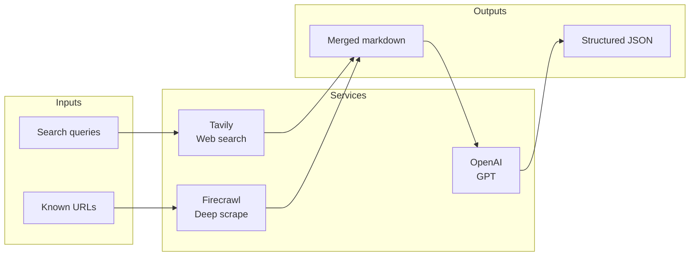

---

## 2. Pipeline Overview

### Two-pass (Tavily + OpenAI only, e.g. ski resorts)

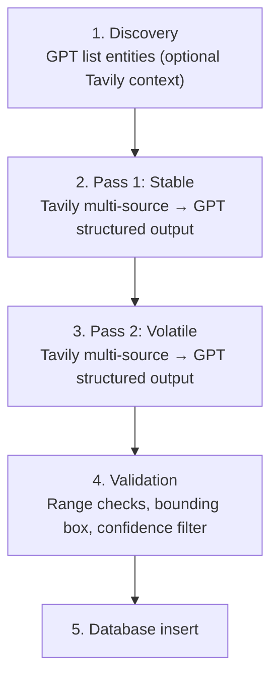

### Four-pass (Tavily + Firecrawl + OpenAI, e.g. glamping)

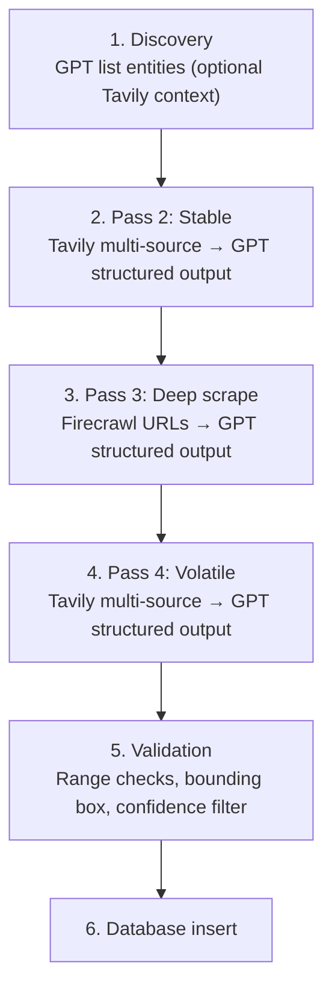

Split data into **stable** (identity, location, terrain), **deep-scrape** (amenities, booking URLs from rendered pages), and **volatile** (prices, reviews) so each pass can be tuned and refreshed independently.

### Glamping resort inclusion criteria (four-pass pipeline)

Properties researched by the glamping pipeline must meet all of the following:

| Requirement | Description |
|-------------|-------------|
| **Minimum 4 glamping units** | Property must have at least 4 glamping units of the target type (e.g. domes, cabins, yurts). Excludes single-unit or two-unit listings. |
| **Glamping-unit focused** | Primary offering is standalone glamping units (beds + linens, enclosed structures). Not tent camping sites or RV pads. |
| **Not a traditional campground** | Exclude properties that are primarily tent/RV campgrounds with a handful of glamping units. We target glamping-first operations. |
| **Not a hotel** | Exclude conventional hotels, motels, or lodges. Focus is on outdoor hospitality with distinct glamping structures (domes, treehouses, safari tents, etc.). |
| **Not an RV park** | Exclude RV parks and RV resorts even if they offer a few cabins or glamping units. |
| **Professional operation** | Currently operating, commercial/professional (not a single host renting one unit on Airbnb). |

Discovery prompts and filters in `scripts/research-glamping-resorts-openai.ts` enforce these so that only qualifying glamping resorts are added to the database.

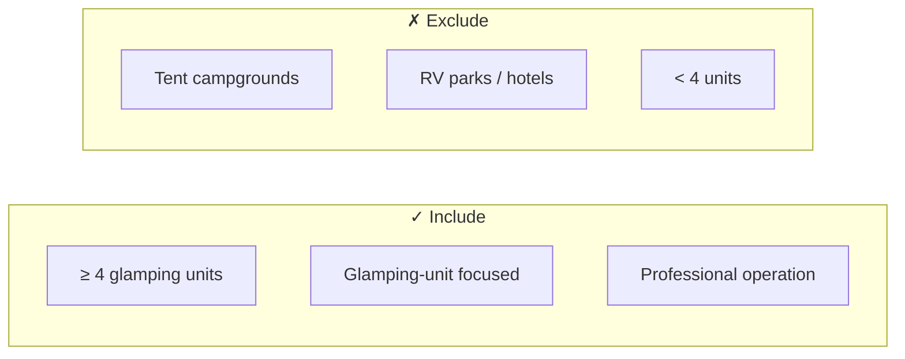

---

## 3. Dependencies and environment

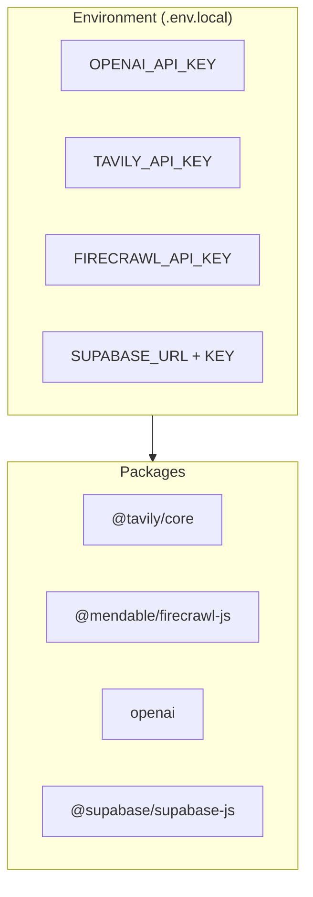

| Package | Purpose |
|---------|---------|
| `@tavily/core` | Web search with `includeRawContent: 'markdown'` |
| `@mendable/firecrawl-js` | Deep scrape URLs to markdown (optional) |
| `openai` | GPT-4.1 / GPT-4o structured outputs |
| `@supabase/supabase-js` | Database insert (or swap for your DB client) |
| `dotenv` | Load `.env.local` |

**Environment variables:**

| Variable | Required | Purpose |
|----------|----------|---------|
| `OPENAI_API_KEY` | Yes | GPT discovery and structured extraction |
| `TAVILY_API_KEY` | Yes (for web search) | Tavily search; free tier at [tavily.com](https://tavily.com) |
| `FIRECRAWL_API_KEY` | No (for deep scrape) | Firecrawl scrape; use `--no-firecrawl` to skip |
| `NEXT_PUBLIC_SUPABASE_URL` | Yes (for DB) | Supabase project URL |
| `SUPABASE_SERVICE_ROLE_KEY` | Yes (for DB) | Supabase service role or secret key |

---

## 4. Tavily (web search)

**Why multi-source?** A single query often misses key facts. Running 2–4 targeted queries per entity and merging results yields better coverage.

**Why raw markdown?** `includeRawContent: 'markdown'` returns the actual page content instead of snippets. GPT can extract structured data from full paragraphs and tables.

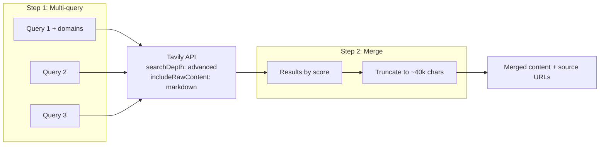

### Implementation pattern

```ts
type SearchQuery = { query: string; domains?: string[] };

async function tavilyMultiSearch(
  queries: SearchQuery[],
): Promise<{ content: string; sourceUrls: string[] }> {
  const allResults: Array<{ content: string; url: string; score: number }> = [];

  for (const { query, domains } of queries) {
    const response = await tavilyClient.search(query, {
      searchDepth: 'advanced',
      maxResults: 3,
      includeAnswer: true,
      includeRawContent: 'markdown',
      ...(domains?.length ? { includeDomains: domains } : {}),
    });
    for (const r of response.results) {
      const text = (r.rawContent || r.content || '').slice(0, 10000);
      if (text) allResults.push({ content: text, url: r.url, score: r.score });
    }
    await sleep(600); // Rate limit
  }

  // Sort by score, merge, truncate to ~40k chars
  allResults.sort((a, b) => b.score - a.score);
  let totalLen = 0;
  const parts: string[] = [];
  for (const r of allResults) {
    if (totalLen + r.content.length > 40000) break;
    parts.push(`[Source: ${r.url}]\n${r.content}`);
    totalLen += r.content.length;
  }
  return { content: parts.join('\n\n---\n\n'), sourceUrls: [...] };
}
```

### Query design

**Pass 1 (stable data):** Use domain filters to hit authoritative sources.

- `"{entity name}" site:authoritative-source.com` – primary stats
- `"{entity name}" site:wikipedia.org` – history, facts
- `"{entity name}" site:industry-directory.com` – comprehensive stats

**Pass 2 (volatile data):** Broader queries for current info.

- `"{entity name}" prices 2025` – pricing
- `"{entity name}" hours schedule season` – operating hours, dates

---

## 5. Firecrawl (deep scrape)

**When to use:** After Tavily has returned candidate URLs (e.g. property site, Hipcamp, Glamping Hub). Firecrawl renders JavaScript and returns full markdown, so GPT can extract amenities, booking links, and pricing that don’t appear in search snippets.

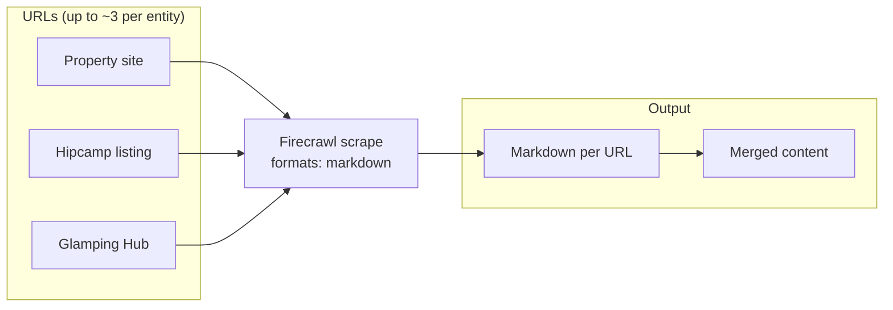

**Implementation pattern (from glamping pipeline):**

```ts
import FirecrawlApp from '@mendable/firecrawl-js';

const firecrawl = new FirecrawlApp({ apiKey: process.env.FIRECRAWL_API_KEY });

async function firecrawlScrape(urls: string[]): Promise<{ content: string; scrapedUrls: string[] }> {
  const parts: string[] = [];
  const scrapedUrls: string[] = [];
  for (const url of urls) {
    const result = await firecrawl.scrape(url, { formats: ['markdown'] });
    const md = result.markdown || '';
    if (md) {
      parts.push(`[Source: ${url}]\n${md.slice(0, 10000)}`);
      scrapedUrls.push(url);
    }
    await sleep(1500); // Rate limit
  }
  return { content: parts.join('\n\n---\n\n'), scrapedUrls };
}
```

**Typical URLs to scrape per entity:** Official property URL, Hipcamp listing URL, Glamping Hub listing URL (up to ~3 URLs per entity to stay within content limits).

---

## 6. OpenAI API (GPT structured outputs and discovery)

**Why JSON schema instead of `json_object`?** Strict schemas enforce exact field names and types, reducing hallucination and malformed output.

**Why field-level confidence?** GPT returns `high`/`medium`/`low` per category. You can filter low-confidence rows or flag them for manual review.

**Models:** Prefer `gpt-4.1` with fallback to `gpt-4o` on 404/model_not_found. Use `temperature: 0.1` for extraction, `0.3` for discovery.

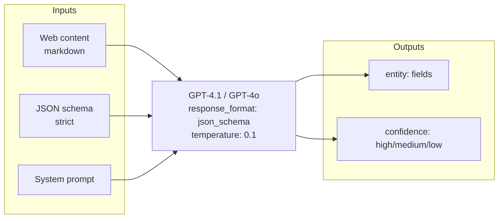

### Schema builder pattern

```ts
function buildExtractionSchema(
  schemaName: string,
  fields: readonly string[],
  confidenceCats: readonly string[],
): object {
  const resortProps: Record<string, object> = {};
  for (const f of fields) {
    resortProps[f] = f === 'name' ? { type: 'string' } : { anyOf: [{ type: 'string' }, { type: 'null' }] };
  }
  const confProps: Record<string, object> = {};
  for (const c of confidenceCats) {
    confProps[c] = { type: 'string', enum: ['high', 'medium', 'low'] };
  }
  return {
    name: schemaName,
    strict: true,
    schema: {
      type: 'object',
      properties: {
        entity: { type: 'object', properties: resortProps, required: [...fields], additionalProperties: false },
        confidence: { type: 'object', properties: confProps, required: [...confidenceCats], additionalProperties: false },
      },
      required: ['entity', 'confidence'],
      additionalProperties: false,
    },
  };
}
```

### API call

```ts
const response = await openai.chat.completions.create({
  model: 'gpt-4.1',  // fallback to gpt-4o if 404
  messages: [
    { role: 'system', content: 'You extract structured data from web sources. Use null for unknown. Store numbers as strings.' },
    { role: 'user', content: `Extract data for "${entityName}" from:\n\n${content}` },
  ],
  temperature: 0.1,
  response_format: { type: 'json_schema', json_schema: schema },
  max_tokens: 6000,
});
```

---

## 7. Multi-pass enrichment (stable / deep-scrape / volatile)

**Why multiple passes?** Mixing stable and volatile data in one prompt increases hallucination. Stable data (identity, location, terrain) comes from curated sources; deep-scrape data (amenities, booking URLs) from rendered pages; volatile data (prices, reviews) from current web results. Separate prompts and sources improve accuracy.

| Pass | Data type | Example fields | Source |
|------|-----------|----------------|--------|
| 1 (Stable) | Identity, location, stats | name, location, elevation, description | Tavily (domain-filtered) |
| 2 (Deep scrape) | Rendered page details | unit amenities, booking URLs, check-in, rates | Firecrawl (property + listing URLs) |
| 3 (Volatile) | Current, changing | prices, hours, reviews, social | Tavily (broad queries) |

**Merge strategy:** Each pass overlays the merged record. Non-null values from later passes overwrite earlier ones. When Firecrawl is skipped (`--no-firecrawl`), only Tavily passes run.

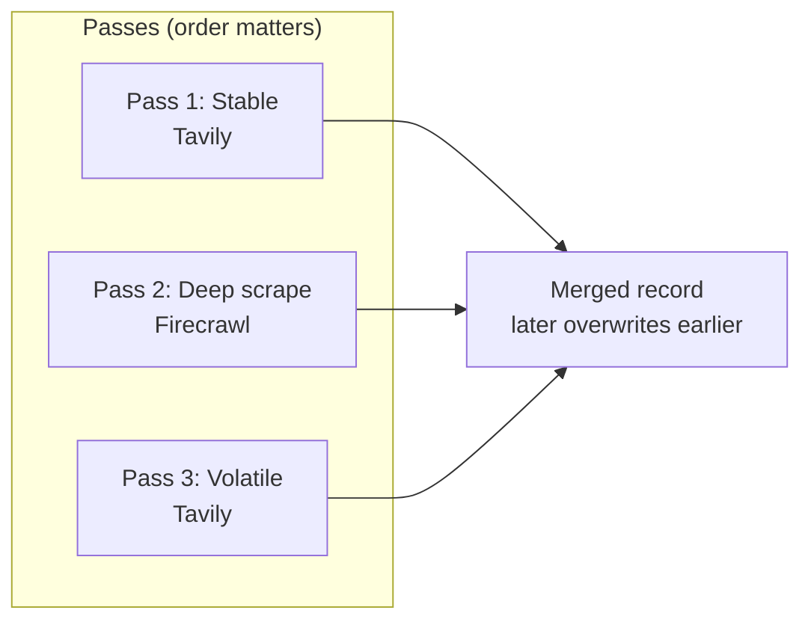

---

## 8. Validation layer

Run after GPT extraction to catch obvious errors.

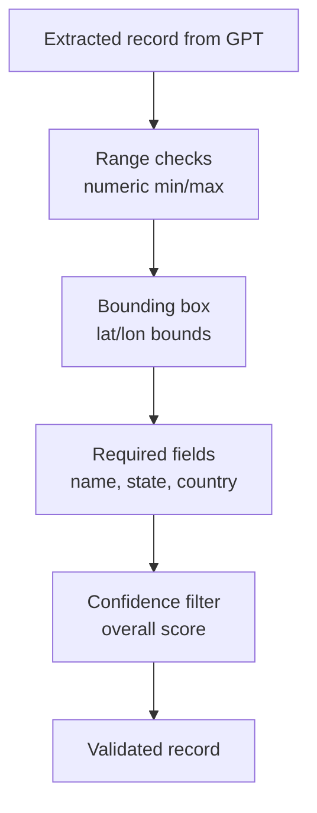

### Range checks

Define min/max for numeric fields. Values outside range → set to `null` and log warning.

```ts
const rangeCheck = (field: string, min: number, max: number) => {
  const n = parseFloat(String(r[field] || '').replace(/[$,]/g, ''));
  if (!isNaN(n) && (n < min || n > max)) {
    warnings.push(`${field}=${r[field]} outside [${min}, ${max}]`);
    r[field] = null;
  }
};
rangeCheck('vertical_drop_ft', 100, 5500);
rangeCheck('lift_ticket_price_adult', 10, 400);
```

### Bounding box (for geo)

If entities are geographically constrained (e.g. USA + Canada):

```ts
if (lat !== null && (lat < 24 || lat > 72)) r.lat = null;
if (lon !== null && (lon < -170 || lon > -50)) r.lon = null;
```

### Required fields

Reject or flag rows missing critical fields: `name`, `state_province`, `country` (or your equivalents).

### Confidence filter

Compute overall `data_confidence_score` from category confidence:

- `low` – any critical category (e.g. location, terrain) is `low`
- `high` – 60%+ categories are `high`
- `medium` – otherwise

---

## 9. Discovery phase

Before enrichment, you need a list of entities. Use GPT with optional Tavily context:

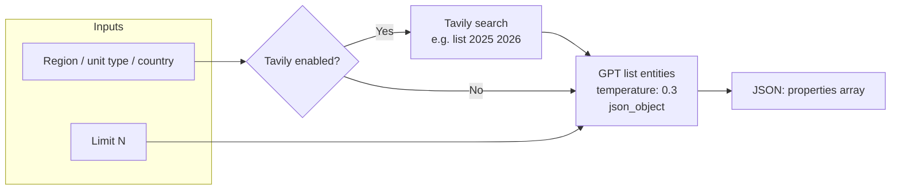

```ts
// Optional: fetch current list from web
const { content } = await tavilyMultiSearch([
  { query: `${region} ski resorts list 2024 2025` },
]);

const prompt = `List notable ski resorts in ${region}. Return JSON: { "resorts": [{ name, city, state_province, country, ... }] }
${content ? `\nWeb context:\n${content}` : ''}`;

const response = await openai.chat.completions.create({
  model: 'gpt-4.1',
  messages: [{ role: 'user', content: prompt }],
  temperature: 0.3,
  response_format: { type: 'json_object' },
  max_tokens: 8000,
});
```

Deduplicate against existing DB rows before enriching.

---

## 10. CLI modes (entity research scripts)

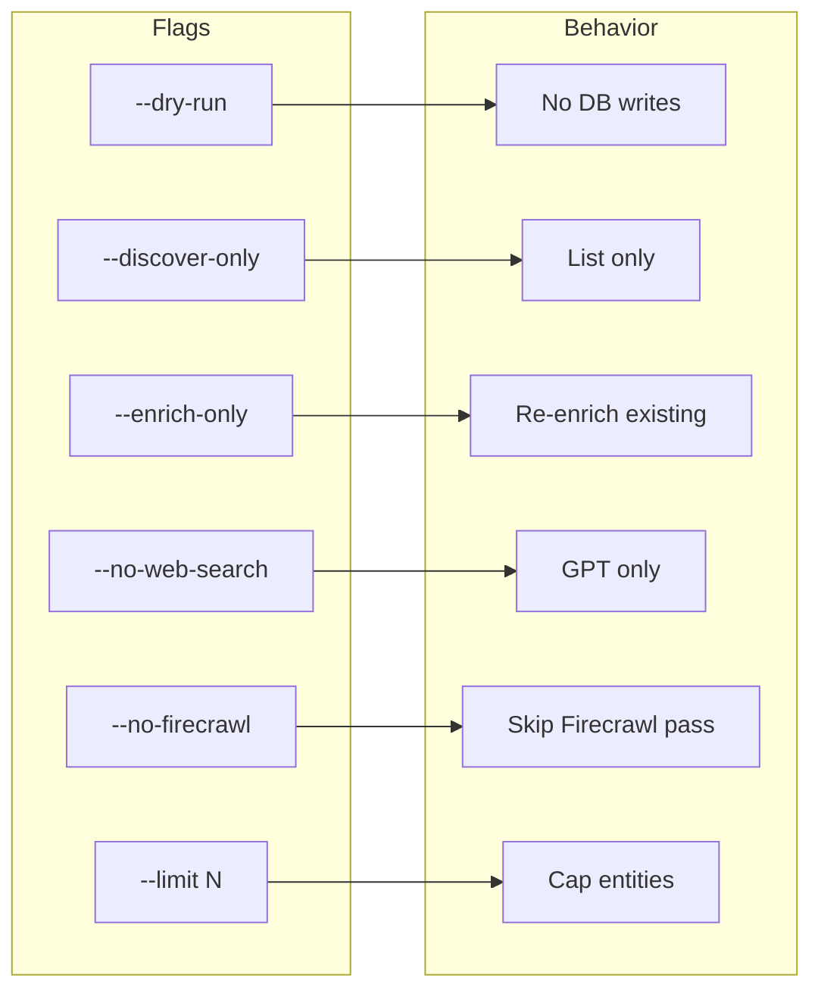

| Flag | Behavior |
|------|----------|
| (none) | Full pipeline: discover → enrich → validate → insert |
| `--dry-run` | No DB writes, print what would be inserted |
| `--discover-only` | List entities, no enrichment |
| `--enrich-only` | Re-enrich existing rows from DB |
| `--no-web-search` | GPT only, skip Tavily |
| `--no-firecrawl` | Skip Firecrawl deep-scrape pass (glamping script) |
| `--limit N` | Limit entities per region/unit type |
| `--unit-type TYPE` | Single unit type, e.g. `domes` (glamping script) |

---

## 11. Checklist for new projects

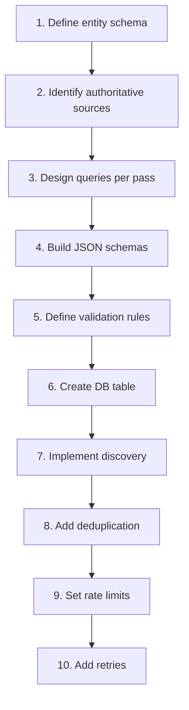

1. **Define your entity schema** – List all fields, split into stable vs volatile.
2. **Identify authoritative sources** – Which domains have reliable data? (Wikipedia, industry sites, official sites.)
3. **Design queries** – 2–4 queries per pass, with domain filters for pass 1.
4. **Build JSON schemas** – One for stable, one for volatile. Add confidence categories.
5. **Define validation rules** – Range checks, bounding box, required fields.
6. **Create DB table** – Run migration before first run.
7. **Implement discovery** – GPT list with optional Tavily context.
8. **Add deduplication** – Check existing rows before insert (e.g. `name` + `country`).
9. **Set rate limits** – `sleep(600)` between Tavily calls, `sleep(2000)` between entities.
10. **Add retries** – 4 retries for 5xx/429, fallback model if 404.

---

## 12. Where each service is used in the codebase

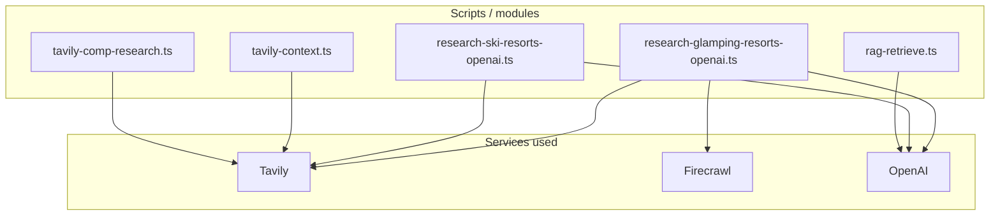

| Use case | Tavily | Firecrawl | OpenAI |
|----------|--------|-----------|--------|
| **Entity research (glamping)** | Discovery + stable + volatile passes | Deep scrape property/listing URLs | Discovery + 3 extraction passes |
| **Entity research (ski)** | Discovery + stable + volatile passes | — | Discovery + 2 extraction passes |
| **Report draft (market context)** | `lib/ai-report-builder/tavily-context.ts` – tourism, market overview | — | Report generation |
| **Report comparables** | `lib/ai-report-builder/tavily-comp-research.ts` – nearby glamping/RV comps | — | Enrichment |
| **RAG / embeddings** | — | — | `lib/ai-report-builder/rag-retrieve.ts` (OpenAI embeddings) |

---

## 13. Reference implementations

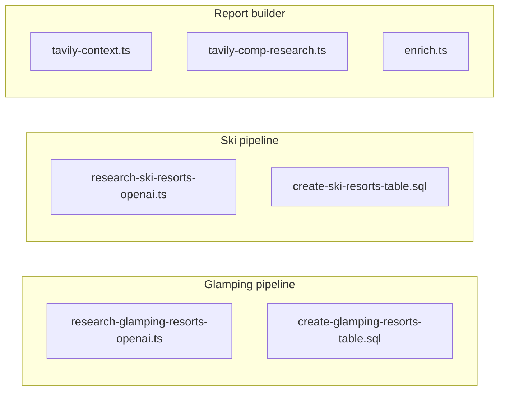

| Pipeline | Script | Migration | Notes |
|----------|--------|-----------|--------|
| **Glamping (Tavily + Firecrawl + OpenAI)** | `scripts/research-glamping-resorts-openai.ts` | `scripts/migrations/create-glamping-resorts-table.sql` | Four-pass; optional `--no-firecrawl` |
| **Ski (Tavily + OpenAI)** | `scripts/research-ski-resorts-openai.ts` | `scripts/migrations/create-ski-resorts-table.sql` | Two-pass; see `docs/SKI_RESORTS_AI_SCRAPING_GUIDE.md` |
| **Report context/comps** | — | — | `lib/ai-report-builder/tavily-context.ts`, `tavily-comp-research.ts`, `enrich.ts` |

---

## 14. Cost notes (per ~30 entities)

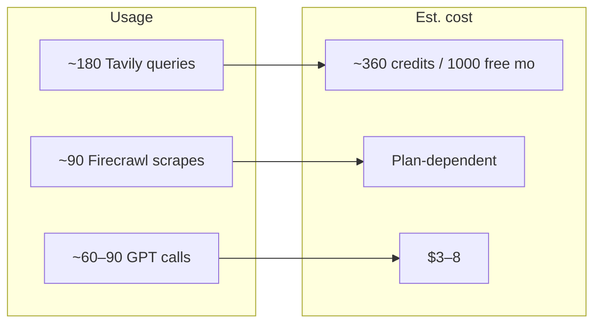

| Service | Usage | Est. cost |
|---------|-------|-----------|
| Tavily | ~180 advanced queries | ~360 credits (1000 free/month) |
| Firecrawl | ~90 scrape requests (if used) | Depends on plan |
| OpenAI | ~60–90 GPT-4.1 calls + discovery | ~$3–8 |
| Supabase | ~30 inserts | Free tier |
