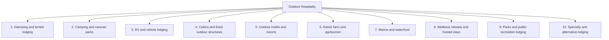

# Outdoor hospitality industry taxonomy

**Status:** Reference taxonomy (May 2026)  
**Audience:** Data ops, research pipelines, admin classification, product cohort design  
**Related code:** `lib/glamping-property-types.ts`, `lib/glamping-land-operator-category.ts`, `lib/glamping-market-snapshot-property-type-filter.ts`, `lib/public-map-cohort-filters.ts`

---

## Purpose

This document defines a **full industry categorization** for outdoor hospitality: parent segments, product subcategories, and how they map to Sage database fields. It complements (does not replace) existing fields:

| Field | Role |
|-------|------|
| `property_type` | **Product / business model** — small canonical enum for admin UI and cohort filters |
| `unit_type` | **Physical accommodation** — tent, yurt, cabin, RV site, etc. |
| `land_operator_category` | **Land tenure / operator** — private commercial vs public park systems |
| `is_glamping_property` | **Glamping market cohort** — include in glamping analytics, map, comps? (`Yes` / `No`) |
| `glamping_service_tier` | **Service / amenity level** within glamping — see [GLAMPING_SERVICE_TIER.md](./GLAMPING_SERVICE_TIER.md) |

Legacy free-text `property_type` values were consolidated in `scripts/migrations/normalize-legacy-property-types-2026-05-21.sql`. This taxonomy explains the **target model** and recommended next steps.

---

## Recommended approach (summary)

### 1. Three-layer model — do not collapse into one field

```text
outdoor_hospitality_segment   →  industry parent (10 segments, documentation / analytics)
property_subtype              →  product subcategory (~40 controlled values, optional Phase 2)
property_type                 →  Sage canonical enum (7 today → ~12 max, admin + SQL cohorts)
unit_type                     →  physical unit
land_operator_category        →  tenure (4 values)
is_glamping_property          →  glamping market inclusion
```

**Rule:** One property gets **one primary** `property_type` (dominant revenue and guest promise). Subcategory and unit diversity are recorded elsewhere.

### 2. Keep `property_type` small; add subtypes only if needed

| Principle | Rationale |
|-----------|-----------|
| Cap canonical `property_type` at **~10–12 values** | Admin dropdown, map exclusions, and brands filters stay maintainable |
| **Re-formalize `Glamping Resort`** | Already in DB and `/brands` cohort; distinct from small-operator `Glamping` |
| Add **Guest Ranch**, **Farm Stay**, **Safari Camp**, **Wellness Retreat** only when volume or cohort rules justify them | Avoid repeating the pre-2026 sprawl of 50+ free-text labels |
| **Do not** make Farm Stay or Guest Ranch “subcategories of Glamping” in `property_type` | They are overlapping segments; use sibling types + `is_glamping_property` |
| **Never** store unit names in `property_type` | Treehouse, Dome, Yurt → `unit_type` (see `lib/glamping-property-type-mislabels.ts`) |
| **Never** store land tenure in `property_type` | State/federal park → `land_operator_category` |

### 3. Cohort rules (explicit)

| Surface | Recommended `property_type` inclusion | Other filters |
|---------|--------------------------------------|---------------|
| **Public glamping map** | `Glamping`, `Glamping Resort`, `Landscape Hotel`; null/empty allowed | Exclude `Campground`, `RV Resort`, `Outdoor Boutique Hotel`, `Unknown`; `is_glamping_property = Yes`; private commercial land — see `lib/public-map-cohort-filters.ts` |
| **Glamping market snapshot** | `Glamping` only | Published, open, private commercial |
| **Brands rankings** | `Glamping`, `Glamping Resort`, `Outdoor Boutique Hotel` | See `lib/glamping-market-snapshot-property-type-filter.ts` |
| **Directory / RV-campground context** | `Campground`, `RV Resort` | `is_glamping_property` often `No` |
| **Comps (glamping)** | Canonical types in `GLAMPING_PROPERTY_TYPE_ALLOWED` | Land operator + published status |

When adding a new `property_type`, update cohort constants in the same PR.

### 4. Assignment decision tree

1. **Dominant guest promise** — What is the H1 positioning on the property website?
2. **Dominant inventory by unit count** — If ≥70% RV sites, parent is RV/campground even with glamping add-ons.
3. **Hotel corridor vs outdoor structure** — Room-forward resort → `Outdoor Boutique Hotel` or `Landscape Hotel`; tent/pod-forward → `Glamping` / `Glamping Resort`.
4. **Public land** — Set `land_operator_category`; `property_type` can still be `Campground` or `Glamping`.
5. **Hybrids** — One primary `property_type` + optional future `property_subtype` (e.g. `Campground` + `glamping_loop`).

### 5. Phased implementation

| Phase | Work |
|-------|------|
| **Phase 0 (now)** | Use this doc for manual classification and research prompts; map rows to current canonical types |
| **Phase 1** | Add `Glamping Resort` to `GLAMPING_PROPERTY_TYPE_FORM_OPTIONS`; stop normalizing it to `Glamping` in new migrations |
| **Phase 2** | Add `Guest Ranch`, `Farm Stay`, `Safari Camp`, `Wellness Retreat` to form options + dot colors + cohort tables |
| **Phase 3 (optional)** | Add `property_subtype` column + controlled vocabulary JSON; backfill from legacy strings in normalization migration |

---

## Industry taxonomy (parent → subcategory)

### Overview diagram



---

### 1. Glamping and tented lodging

*Elevated outdoor stays where structure and experience are the product.*

| Subcategory | Description | Typical `unit_type` | Sage `property_type` |
|-------------|-------------|---------------------|----------------------|
| Glamping (general) | Small/medium operator; mixed tent structures | Safari tent, yurt, dome, pod, treehouse | `Glamping` |
| Glamping resort | Destination-scale; multiple unit types; F&B and activities | Mixed | `Glamping Resort` (recommended canonical) |
| Safari / expedition camp | Remote, guided, or seasonal luxury tented camps | Safari tent, bush lodge | `Safari Camp` (proposed) or Glamping Resort |
| Tented lodge / luxury camp | Permanent tented property; lodge service | Safari tent, pavilion | Glamping Resort |
| Treehouse resort | Treehouses as primary inventory | Treehouse | Glamping Resort (unit = Treehouse) |
| Dome / geodesic resort | Dome-forward destination | Dome | Glamping Resort |
| Airstream / vintage trailer park | Curated trailer clusters | Airstream, vintage trailer | `Glamping` or `RV Resort` by dominant model |
| Bubble / transparent lodging | Stargazing bubbles | Bubble tent, dome | `Glamping` |
| Floating glamping | On-water tents/pods (non-slip marina model) | Floating tent | `Glamping` or `Marina` |
| Pop-up / seasonal glamping | Festival or seasonal fields | Bell tent, tent | `Glamping` |

**`is_glamping_property`:** Usually `Yes`.

---

### 2. Camping and caravan parks

*Self-directed stays; guest brings gear or rents basic shelter.*

| Subcategory | Description | Typical `unit_type` | Sage `property_type` |
|-------------|-------------|---------------------|----------------------|
| Campground (general) | Tent/RV sites; minimal services | Tent site, RV site | `Campground` |
| Family campground / KOA-style | Branded chains; pools; mixed inventory | Tent site, RV site, cabin | `Campground` |
| Holiday park | EU/AU/NZ mixed chalet + caravan + camping | Static caravan, chalet | `Campground` (or proposed `Holiday Park`) |
| Rustic / backcountry camp | Basic sites; often public land | Tent site | `Campground` + public `land_operator_category` |
| Group / scout camp | Organized groups | Bunk, cabin | Usually out of commercial cohort |
| Glamping within campground | Premium loop inside campground | Mixed | `Campground` + glamping unit rows flagged |
| Workamping / long-stay | Seasonal residents | RV site | `Campground` / `RV Resort` |

**`is_glamping_property`:** `No` for core camping; `Yes` only for material glamping inventory (property or unit level).

---

### 3. RV and vehicle lodging

*Vehicle-accessible sites and resort infrastructure.*

| Subcategory | Description | Typical `unit_type` | Sage `property_type` |
|-------------|-------------|---------------------|----------------------|
| RV resort | Full-hookup; amenities; resort positioning | RV site, park model | `RV Resort` |
| RV park | Overnight/seasonal; fewer amenities | RV site | `RV Resort` or `Campground` |
| Mixed RV + glamping resort | Material glamping + RV | Mixed | Dominant type + `is_glamping_property` on glamping share |
| Van / skoolie hub | Vehicle-as-unit rentals | Van, skoolie | `Glamping` or `RV Resort` |
| Overlanding base | Remote vehicle camps | Dispersed site | `Campground` or specialty |
| Marina RV park | RV at marina | RV site, slip | `Marina` |

**`is_glamping_property`:** `No` unless glamping is separately tracked.

---

### 4. Cabins, cottages, and fixed outdoor structures

*Hard-sided standalone units in natural settings.*

| Subcategory | Description | Typical `unit_type` | Sage `property_type` |
|-------------|-------------|---------------------|----------------------|
| Cabin resort | Many cabins; shared amenities | Cabin, lodge room | Glamping Resort, `Campground`, or proposed `Cabin Resort` |
| Cottage / chalet village | EU-style clusters | Cottage, chalet | `Campground` / Holiday park |
| Tiny home village | Tiny houses as product | Tiny home | `Glamping` or cabin resort |
| Rustic lodge | Central lodge + cabins | Lodge, cabin | `Outdoor Boutique Hotel` or `Glamping` |
| Chalet park | Ski/mountain clusters | Chalet | Cabin resort / `Campground` |
| Park model community | Long-stay cabin neighborhoods | Park model | `RV Resort` / `Campground` |

**`is_glamping_property`:** `Yes` only when marketed and inventoried as luxury cabin glamping.

---

### 5. Outdoor hotels and resorts

*Hotel or resort operating model; nature-forward positioning.*

| Subcategory | Description | Typical `unit_type` | Sage `property_type` |
|-------------|-------------|---------------------|----------------------|
| Outdoor boutique hotel | Design-led; rooms + some outdoor structures | Room, bungalow, tent | `Outdoor Boutique Hotel` |
| Landscape hotel | Architecture integrated with landscape | Pavilion, villa, tent | `Landscape Hotel` |
| Nature lodge resort | Lodge-centric; spa, dining | Lodge room, cabin | `Outdoor Boutique Hotel` |
| Beach / island eco-resort | Coastal resort | Villa, bungalow, tent | `Outdoor Boutique Hotel` |
| Hot springs resort | Mineral baths central | Room, cabin | `Outdoor Boutique Hotel` (or proposed subtype) |
| Ski / mountain resort (summer glamping) | Seasonal outdoor units | Room, yurt, tent | Resort type + glamping flag on summer units |
| All-inclusive outdoor resort | Package pricing | Mixed | `Outdoor Boutique Hotel` |
| Hotel with glamping adjunct | Hotel-primary; few tents | Room + tent | `Outdoor Boutique Hotel` |

**`is_glamping_property`:** Selective `Yes` when glamping inventory is meaningful.

---

### 6. Ranch, farm, and agritourism

*Place-based hospitality on working land.*

| Subcategory | Description | Typical `unit_type` | Sage `property_type` |
|-------------|-------------|---------------------|----------------------|
| Guest ranch / dude ranch | Riding, ranch activities, western lodge | Lodge, cabin, tent | **Guest Ranch** (proposed) or `Outdoor Boutique Hotel` |
| Luxury ranch resort | High-end ranch + spa | Lodge, villa | `Outdoor Boutique Hotel` or Guest Ranch |
| Farm stay | Working farm experience | Room, cottage, tent | **Farm Stay** (proposed) or `Glamping` |
| Vineyard / winery stay | Wine estate lodging | Cottage, tent | Farm Stay or `Outdoor Boutique Hotel` |
| Agritourism glamping | Farm setting; glamping-primary | Yurt, safari tent | `Glamping` or Farm Stay |
| Orchard / harvest stay | Seasonal agritourism | Cabin, tent | Farm Stay |
| Equestrian center lodging | Riding + overnight | Cabin, room | Guest Ranch or specialty |

**Farm stay vs guest ranch vs glamping:** Use **sibling** `property_type` values, not “subcategory of Glamping.” Set `is_glamping_property = Yes` when tent/yurt/pod inventory is core to market analysis.

---

### 7. Marine and waterfront lodging

*Water central to operations.*

| Subcategory | Description | Typical `unit_type` | Sage `property_type` |
|-------------|-------------|---------------------|----------------------|
| Marina resort | Slips + lodging + F&B | Room, cabin, tent | `Marina` |
| Houseboat / floating lodge | On-water rooms | Houseboat | `Marina` or specialty |
| Lake cabin resort | Lakefront cabins and docks | Cabin | Cabin resort / `Marina` |
| Coastal glamping | Beach tents, pods | Tent, pod | `Glamping` |
| Island eco-lodge | Boat access | Bungalow, tent | `Outdoor Boutique Hotel` / `Marina` |
| Fishing lodge | Guided fishing packages | Cabin, room | Specialty or `Outdoor Boutique Hotel` |

---

### 8. Wellness, retreat, and hosted experiences

*Programming and duration often dominate over unit type.*

| Subcategory | Description | Typical `unit_type` | Sage `property_type` |
|-------------|-------------|---------------------|----------------------|
| Wellness retreat | Spa, detox, yoga immersions | Room, cabin, tent | **Wellness Retreat** (proposed) |
| Spiritual / meditation retreat | Silent or guided retreat | Room, dorm, tent | Wellness Retreat |
| Adventure / outdoor education base | Courses, guides | Bunk, cabin, tent | Specialty |
| Corporate retreat center | Meetings + lodging | Lodge, cabin | Specialty |
| Surf / yoga camp | Activity-led hosted stays | Room, tent, dome | Glamping Resort or Wellness Retreat |
| Thermal / bathhouse stay | Bathing-focused | Room | Hot springs / Wellness |

---

### 9. Parks and public recreation lodging

*Government or public-authority operated outdoor lodging.*

| Subcategory | Description | `land_operator_category` |
|-------------|-------------|--------------------------|
| National park lodging | NPS / Parks Canada concessions | `federal_public` |
| State / provincial park camp | State park campgrounds | `state_park` |
| County / municipal park camp | Local recreation authority | `other_public` |
| Army Corps / federal recreation | USACE, etc. | `federal_public` |
| Forest service / BLM camp | USFS, BLM | `federal_public` |
| Public glamping concession | Private operator on public land | Public operator + `private_commercial` lease note |

**`property_type`:** Often `Campground` or `Glamping`. Excluded from private commercial map via `land_operator_category` (see `lib/glamping-land-operator-category.ts`).

---

### 10. Specialty and alternative lodging

| Subcategory | Notes |
|-------------|--------|
| Hostel / outdoor hostel | Budget shared + pods |
| Hut-to-hut / alpine hut | Trekking networks (EU) |
| Tipi / indigenous-led camp | Use culturally appropriate labeling |
| Zoo / safari park overnight | Theme hospitality |
| Festival / event camping | Often ephemeral — weak fit for permanent DB |
| Religious camp | Retreat subtype |
| Coliving / digital nomad camp | Emerging segment |
| Off-grid eco-lodge | Sustainability-led; map to Glamping or Outdoor Boutique Hotel |

---

## Cross-cutting dimensions

These apply **alongside** parent/subcategory — they do not replace `property_type`.

### Accommodation structure (`unit_type`)

Canonical unit labels live in `lib/glamping-unit-type-normalize.ts` and admin unit-type pickers. Examples: Safari Tent, Yurt, Dome, Cabin, Treehouse, Airstream, RV Site, Tent Site, Villa, Hut, Pod.

### Land and operator (`land_operator_category`)

| Value | Meaning |
|-------|---------|
| `private_commercial` | Private or commercial outdoor hospitality (default for null) |
| `state_park` | State / provincial park system |
| `federal_public` | Federal public land (NPS, USFS, BLM, etc.) |
| `other_public` | County, city, regional public recreation |

### Scale and format (documentation / future tags)

| Dimension | Example values |
|-----------|----------------|
| Scale | Single-site operator · Multi-site brand · Destination resort |
| Inventory model | Single unit type · Mixed resort · Hybrid (camp + glamping + RV) |
| Stay length | Nightly · Weekly · Seasonal · Long-stay |
| Service level | Bare · Mid · Luxury · Ultra-luxury (see `glamping_service_tier`) |

---

## Target canonical `property_type` enum

Current admin options (`lib/glamping-property-types.ts`):

- `Unknown`, `Glamping`, `Outdoor Boutique Hotel`, `RV Resort`, `Campground`, `Landscape Hotel`, `Marina`

**Recommended target set (~12 values):**

| `property_type` | Status | Primary parent segment(s) |
|-----------------|--------|---------------------------|
| `Glamping` | Existing | 1. Glamping and tented |
| `Glamping Resort` | Legacy in DB; add to form | 1. Glamping and tented |
| `Outdoor Boutique Hotel` | Existing | 5. Outdoor hotels |
| `Landscape Hotel` | Existing | 5. Outdoor hotels |
| `Guest Ranch` | Proposed | 6. Ranch / farm |
| `Farm Stay` | Proposed | 6. Ranch / farm |
| `Safari Camp` | Proposed | 1. Glamping and tented |
| `Wellness Retreat` | Proposed | 8. Wellness / retreat |
| `RV Resort` | Existing | 3. RV and vehicle |
| `Campground` | Existing | 2. Camping |
| `Marina` | Existing | 7. Marine |
| `Unknown` | Existing | Unclassified |

---

## Mapping: industry subcategory → Sage fields

| If subcategory is… | Set `property_type` | Typical `is_glamping_property` | Notes |
|-------------------|---------------------|-------------------------------|--------|
| Small glamping operator | `Glamping` | Yes | Default glamping cohort |
| Destination glamping resort | `Glamping Resort` | Yes | Brands + map |
| Safari / tented expedition lodge | `Safari Camp` or Glamping Resort | Yes | International comps |
| Outdoor boutique / nature lodge | `Outdoor Boutique Hotel` | Maybe | Map excludes today |
| Landscape architecture hotel | `Landscape Hotel` | Yes | Map includes |
| Guest ranch / dude ranch | `Guest Ranch` | Maybe | Lodge-dominant → No |
| Farm stay / vineyard stay | `Farm Stay` | Maybe | Tent-dominant → Yes |
| Wellness / retreat program | `Wellness Retreat` | Maybe | |
| KOA / family campground | `Campground` | No | |
| Holiday park | `Campground` | No | |
| RV resort / park | `RV Resort` | No | |
| Marina resort | `Marina` | No | Unless glamping units tracked separately |
| State/federal park camp | `Campground` | Optional | Set `land_operator_category` |
| Unsure | `Unknown` | — | Review queue |

---

## Example classifications

| Archetype | Parent segment | Subcategory | `property_type` | `is_glamping_property` |
|-----------|----------------|-------------|-----------------|------------------------|
| 40-site yurt farm | Ranch / farm | Agritourism glamping | `Farm Stay` or `Glamping` | Yes |
| Dude ranch, lodge + 2 yurts | Ranch / farm | Guest ranch | `Guest Ranch` | Yes if glamping material |
| Under Canvas | Glamping | Glamping resort | `Glamping Resort` | Yes |
| KOA with cabins + RV | Camping | Family campground | `Campground` | No |
| Ventana Big Sur | Hotels | Landscape hotel | `Landscape Hotel` | Yes |
| State park yurts | Parks | State park camp | `Campground` | Yes (unit-level optional) |
| Longitude 131° | Glamping | Safari / tented lodge | `Glamping Resort` or `Safari Camp` | Yes |
| Civana / hot springs hotel | Hotels | Hot springs resort | `Outdoor Boutique Hotel` | No |

---

## Legacy string mapping (reference)

Strings below were bulk-mapped in `normalize-legacy-property-types-2026-05-21.sql`. Use this table when backfilling or reviewing `Unknown` rows.

| Legacy `property_type` (sample) | Mapped to |
|--------------------------------|-----------|
| Treehouse Resort, Eco Glamping, Farm Glamping, Yurt Resort, … | `Glamping` |
| Luxury Lodge, Wellness Resort, Beach Resort, Hot Springs Resort, … | `Outdoor Boutique Hotel` |
| Holiday Park, National Park Camp, … | `Campground` |
| RV Park | `RV Resort` |
| Boutique Camping (most) | `Glamping` or `Outdoor Boutique Hotel` (slug-specific) |

Full list: see migration file.

---

## Research and AI classification

When prompting OpenAI or research scripts, prefer **industry subcategory** language in instructions, then **normalize to canonical `property_type`** on insert.

Update `lib/infer-glamping-classification-from-text.ts` prompts to list canonical types (not open-ended “Luxury Campground”) once Phase 1–2 enums are locked.

---

## Changelog

| Date | Change |
|------|--------|
| 2026-05-26 | Initial taxonomy and recommended approach |
