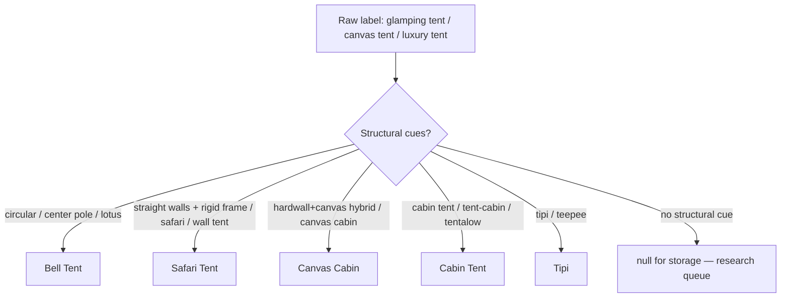

# Structural tent & canvas types

**Source of truth in code:** `lib/glamping-structural-tent-types.ts` (wired into taxonomy descriptions, LLM enrichment prompts, normalize, and glossary).

Canvas Tent is **retired** as a catch-all storage label. Prefer:

| Canonical | Structure | Common aliases |
|---|---|---|
| **Bell Tent** | Circular base, single tall center pole, A-frame door | lotus belle |
| **Safari Tent** | Four straight walls, peaked roof, **rigid** internal frame (room-like) | wall tent, safari suite |
| **Cabin Tent** | Portable soft-wall cabin-style tent (no hardwall core) | cabin tent, tent-cabin, tentalow |
| **Canvas Cabin** | Hardwall bath/porch/kitchen + canvas envelope hybrid | canvas cabin, classic/family canvas cabin |
| **Tipi** | Cone / pole structure | teepee |

**Canvas Cabin ≠ Cabin Tent.** Rock Creek–style hybrids (hard-framed bathroom + screened porch + canvas) are Canvas Cabin; Camp Dakota–style portable cabin tents are Cabin Tent.

## Normalize rules (`lib/glamping-unit-type-normalize.ts`)

- `wall tent(s)` → **Safari Tent**
- `canvas cabin`, `classic/family canvas cabin` → **Canvas Cabin**
- `cabin tent(s)`, `tent-cabin`, `tentalow`, etc. → **Cabin Tent**
- `teepee(s)` → **Tipi**
- Ambiguous `tent` / `tents` / `glamping tent` / `luxury tent` / `deluxe tent` / `canvas tent` → **`null`**

## Legacy

- Existing `Canvas Tent` rows remain until remapped; excluded from market-snapshot unit counts.
- Ambiguous queue: `docs/data/CANVAS_TENT_AMBIGUOUS_QUEUE_2026-07-13.csv`
- Restore script: `scripts/apply-restore-canvas-cabin-2026-07-13.ts`
