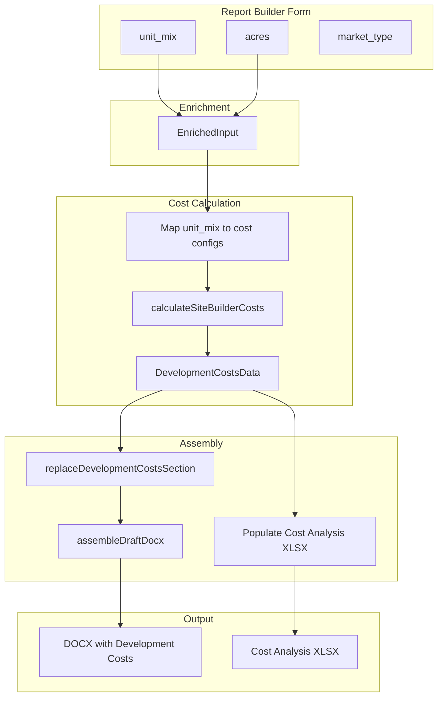

# Development Costs Integration for Report Builder

> **Status: Implemented** (2026-03-18). Run `scripts/migrations/add-reports-cost-analysis-file-path.sql` to add the `cost_analysis_file_path` column.

## Summary

Use [Development Costs.docx](local_data/Development Costs.docx) as the narrative template and [Cost Analysis Section.xlsx](local_data/Cost Analysis Section.xlsx) as the supporting data source to populate the Development Costs section in feasibility study reports generated by the Report Builder. The training instructions describe MVS references, quality levels, multipliers, and AI prompts—these inform the narrative generation and data mapping.

---

## Current State

| Component | Status |
|-----------|--------|
| **Development Costs section in DOCX** | Present in template; only images replaced; no content population |
| **Cost Analysis XLSX** | Used by Site Builder export; not linked to Report Builder |
| **Report Builder XLSX** | ToT (Intake Form) + Comparables; no cost sheets |
| **Report Builder input** | `unit_mix` (type, count), acres, property_name, amenities_description |
| **feasibility_development_costs** | Populated from uploaded studies; used for RV costs and amenity sync |

---

## Development Costs.docx Structure

```
Development Costs (heading)
├── Intro: MVS, manufactured housing park segment, quality levels
├── SOURCE: MVS
├── Multipliers (time, local labor, site-specific)
├── SOURCE: MVS
├── Site Development Costs [table placeholder]
├── Unit Costs [table placeholder]
├── Additional Structures and Site Improvements [table placeholder]
├── Personal Property [table placeholder]
└── Total Project Cost [table placeholder]
```

---

## Cost Analysis Section.xlsx → DOCX Mapping

| XLSX Sheet | Data | DOCX Target |
|------------|------|-------------|
| Site Dev Cost | # sites, per-site costs, unit costs (rows 39–42), totals | Site Development Costs, Unit Costs tables |
| Add. Bldg Improv. | Items, SF, $/SF, Total | Additional Structures table |
| Total Proj. Cost | Summary rollup | Total Project Cost table |

---

## Implementation Plan

### Phase 1: Development Costs Data Pipeline

**1.1 Create `lib/ai-report-builder/development-costs.ts`**

- **Input:** `EnrichedInput` (unit_mix, acres, total_sites, market_type) + optional Site Builder configs
- **Logic:**
  - Map Report Builder `unit_mix` to cost configs: `{ type: string, count: number }` → glamping/RV configs
  - Call `calculateSiteBuilderCosts` (or a simplified variant) when we have enough data
  - Fallback: derive from `feasibility_development_costs` for a comparable study, or use CCE defaults
- **Output:** `DevelopmentCostsData` interface:
  - `siteDevCosts`: { totalRVSites, totalGlampingUnits, rvTotal, glampingTotal, lineItems? }
  - `unitCosts`: { items: { name, qty, costPerUnit, subtotal }[] }
  - `addBldgImprovements`: { items: { name, sf, costPerSf, total }[], total }
  - `totalProjectCost`: { siteDev, unitCosts, addBldg, hardCosts, softCosts, land, total }

**1.2 Unit mix → cost config mapping**

- Report Builder `UNIT_TYPES` (Cabin, Yurt, etc.) map to `site_builder_glamping_types` slugs
- Add mapping in `lib/ai-report-builder/unit-mix-to-cost-config.ts` or within development-costs.ts
- For RV: if `unit_mix` includes "RV Site", use default RV site type

### Phase 2: DOCX Section Replacement

**2.1 Add `replaceDevelopmentCostsSection` in `lib/ai-report-builder/assemble-docx.ts`**

- Pattern: Same as `replaceStaticSiteAnalysisSection`—find "Development Costs" heading, replace content until next section
- **Narrative:** Use Development Costs.docx intro text as base; optionally parameterize quality level, MVS section refs
- **Tables:** Build OOXML tables from `DevelopmentCostsData`:
  - Site Development Costs table (from siteDevCosts)
  - Unit Costs table (from unitCosts)
  - Additional Structures table (from addBldgImprovements)
  - Total Project Cost table (from totalProjectCost)
- **Placeholder:** Add `{development_costs}` or section-specific placeholder if template uses it; otherwise use XML replacement

**2.2 Extend `GeneratedSections` and `assembleDraftDocx`**

- Add `development_costs_data?: DevelopmentCostsData` to `GeneratedSections`
- In `assembleDraftDocx`, call `replaceDevelopmentCostsSection(zip, developmentCostsData)` after `replaceDemandIndicatorsSection`

### Phase 3: XLSX Companion Workbook

**3.1 Attach Cost Analysis XLSX to report**

- In `generate-draft/route.ts`, after assembling DOCX:
  - Call `buildAndExportCostAnalysisXlsx` with configs derived from `enriched.unit_mix`
  - Upload to `report-uploads/{report_id}/cost-analysis.xlsx` (or merge into existing template.xlsx)
- **Option A:** Merge Cost Analysis sheets into report template XLSX (ToT + Comparables + Site Dev Cost + Add. Bldg Improv. + Total Proj. Cost)
- **Option B:** Keep separate; add download link for `cost-analysis.xlsx` on report page

**3.2 Report template XLSX**

- Current: `report-templates/{rv|glamping}/template.xlsx` has ToT + Comparables
- Either: Add Cost Analysis sheets to that template, or use Cost Analysis Section.xlsx as a second template and merge at runtime

### Phase 4: Report Builder UI and Enrichment

**4.1 Optional: Site Builder linkage**

- Add "Use Site Builder config" option: if user has configured Site Builder for this report (stored in report metadata or session), use those configs for cost calculation
- Otherwise derive from unit_mix

**4.2 Enrichment**

- `enrichReportInput` already has unit_mix, acres, total_sites
- No new API calls needed for basic cost derivation
- Optional: Fetch `feasibility_development_costs` for a selected comparable study to use as cost reference

### Phase 5: AI-Generated Narrative (Optional)

- Use training instructions to generate MVS intro, multipliers explanation
- Add `generateDevelopmentCostsNarrative` in `generate.ts` with prompt referencing:
  - Quality level (from project description)
  - MVS Section 63 (manufactured housing), 66 (site improvements), 99 (multipliers)
  - Resort description (acres, unit count, quality)

---

## Data Flow Diagram



---

## Files to Create/Modify

| Action | File |
|--------|------|
| Create | `lib/ai-report-builder/development-costs.ts` (data derivation + types) |
| Create | `lib/ai-report-builder/unit-mix-to-cost-config.ts` (mapping) |
| Modify | `lib/ai-report-builder/assemble-docx.ts` (add replaceDevelopmentCostsSection) |
| Modify | `lib/ai-report-builder/types.ts` (DevelopmentCostsData, extend GeneratedSections) |
| Modify | `lib/ai-report-builder/index.ts` (export new modules) |
| Modify | `app/api/admin/reports/generate-draft/route.ts` (call dev costs pipeline, attach XLSX) |
| Optional | `lib/ai-report-builder/generate.ts` (generateDevelopmentCostsNarrative) |
| Optional | `app/admin/reports/[studyId]/page.tsx` (download link for cost-analysis.xlsx) |

---

## Training Instructions Usage

| Instruction | Implementation |
|-------------|-----------------|
| MVS Section 63 (quality, sites) | Narrative text; quality from project/market_type |
| MVS Section 99 (multipliers) | Narrative; multiplier values from template or derived |
| MVS Section 66 (site improvements) | Add. Bldg Improv. items from Site Builder amenities or template |
| Web Research AI prompt | Future: optional AI step to estimate add'l bldg costs from amenities_description |
| M&S AI prompt | Future: optional when CCE/MVS data available |
| Unit Costs (Walden, manufacturers) | Use CCE + site_builder_glamping_types; future: Walden integration |

---

## Edge Cases

1. **No unit_mix:** Use placeholder text "Unit mix to be confirmed" and empty tables
2. **RV-only:** Populate Site Dev Cost; Unit Costs = 0 or omit
3. **Glamping-only:** Populate Unit Costs; Site Dev horizontal = 0 or minimal
4. **Template missing Development Costs:** Skip replacement; no-op
5. **Cost Analysis template missing:** Fall back to DOCX tables only; skip XLSX attachment

---

## Phased Rollout

- **Phase 1–2:** DOCX Development Costs section populated from unit_mix-derived data
- **Phase 3:** Cost Analysis XLSX attached to report
- **Phase 4:** Optional Site Builder linkage
- **Phase 5:** AI narrative for MVS/multipliers
